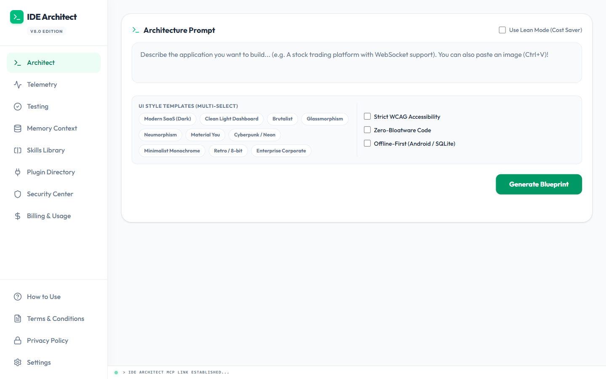
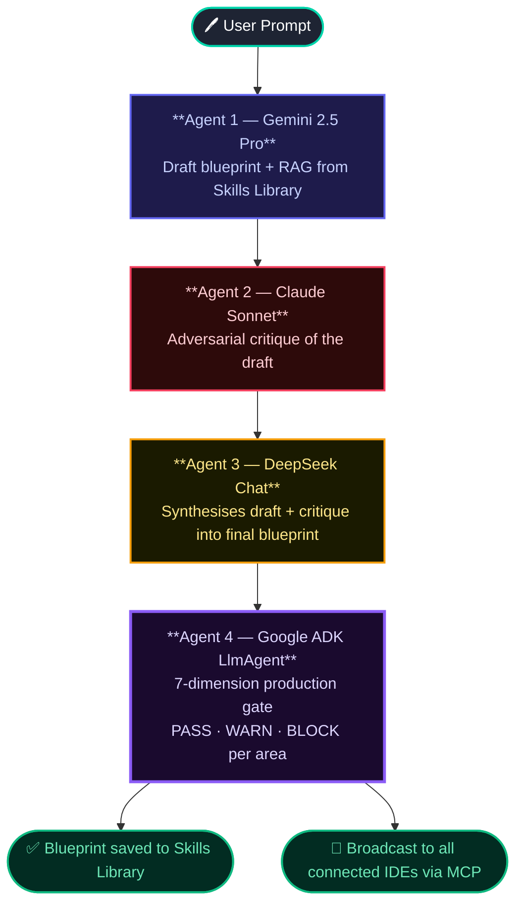

# 🔷 StructZero — The Multi-Agent Planning Layer for Agentic IDEs

> **Built on MCP · Powered by 4 AI Agents · Designed for Antigravity IDE**

StructZero is the missing planning layer between a developer's idea and their agentic IDE. Instead of prompting an IDE directly (getting shallow first-draft code), a developer sends their prompt through StructZero first — a **4-agent AI debate pipeline** that produces a secure, production-hardened architectural blueprint. The IDE takes that blueprint as input and generates dramatically better code.

**Same IDE. Same model. Dramatically different output quality.**

---

## 🎬 Demo Video

[](https://www.youtube.com/watch?v=YOUR_VIDEO_ID)

> **The core demo:** Prompt Antigravity directly → shallow scaffold. Send same prompt through StructZero debate → detailed blueprint → feed to Antigravity → production-grade implementation.

---

## ✨ The 4-Agent Pipeline




> If ADK finds gaps → **"Improve Blueprint"** button re-injects all WARN/BLOCK items as hard constraints → triggers new debate round → hardened blueprint.

---

## 🔌 MCP Server — IDE Integration

Connect StructZero to any MCP-compatible IDE in 2 minutes:

### Antigravity / Cursor / VS Code
```json
{
  "mcpServers": {
    "StructZero": {
      "command": "node",
      "args": ["C:/path/to/StructZero/backend/mcp.js"]
    }
  }
}
```

### Available MCP Tools (11 total)

| Tool | What It Does |
|------|-------------|
| `generate_architecture` | Triggers the full 4-agent debate pipeline |
| `review_codebase` | Reviews code against active blueprint |
| `analyze_workspace` | Deep architectural review of any codebase |
| `store_memory` | Save persistent context facts per user |
| `search_memory` | Semantic memory search across sessions |
| `search_skills` | Query the reusable blueprint skills library |
| `troubleshoot_error` | AI-powered error resolution with codebase context |
| `switch_active_user` | Switch active user profile |
| `create_or_update_profile` | Create or update rules for a user profile |
| `list_profiles` | List all available profiles and the active one |
| `delete_profile` | Delete a specific user profile and its rules |

**Resource:** `workspace://context` — Returns the full active blueprint + memory bank as a single Markdown document, injected into every IDE AI conversation.

---

## 🚀 Quick Start

### Prerequisites
- Node.js 18+
- Python 3.10+
- API Keys: Gemini (required), Anthropic Claude (required), DeepSeek (required)

### 1. Clone & Install Backend
```bash
git clone https://github.com/vishalvermauts/StructZero.git
cd StructZero-mcp-architect/backend
npm install
pip install google-adk   # For the ADK Production Advisor agent

# Create .env from template
copy .env.example .env
# Edit .env with your API keys
```

### 2. Start Backend
```bash
node server.js
# Output: Fastify Server listening on port 3001
# Route tree includes: adk/production-check, architecture, generate, memory, skills...
```

### 3. Install & Start Frontend
```bash
cd ../frontend
npm install
npm run dev
# Frontend: http://localhost:5173
```

### 4. Configure API Keys in UI
1. Open `http://localhost:5173`
2. Click **Settings** tab → enter Gemini, Claude, DeepSeek keys → **Save**

### 5. Generate First Blueprint
Type any prompt and press **Generate**:
```
design a real-time collaborative whiteboard with WebSockets, offline sync, and CRDT conflict resolution
```

### 6. Run ADK Production Check
After generation completes, click **"Run Production Check"** in the violet ADK panel → see 7-dimension PASS/WARN/BLOCK assessment → click **"Improve Blueprint with ADK Findings"** to re-run debate with all gaps as constraints.

---

## 🛡️ Security Features

| Feature | Description |
|---------|-------------|
| SAST Scanner | Auto-audits every blueprint for OWASP Top 10 patterns |
| Auto-Fix | Re-runs debate with vulnerability as explicit constraint |
| ACL Guardrails | Per-model constraint rules injected into every prompt |
| Circuit Breaker | Opossum-powered failover: cloud → local on errors |
| Budget Breaker | Configurable monthly spend cap |
| Input Validation | All file writes sanitized; API endpoints validate type/length |

---

## 🧠 Skills Library

Every blueprint passes through a background pipeline that uses Gemini to extract 1–3 reusable architectural patterns ("skills"), tagged by domain. These power:
- **`search_skills` MCP tool** — IDE retrieves patterns without re-running debate (up to 80% token reduction)
- **RAG injection** — matching skills auto-injected into future Gemini prompts as context
- **Team knowledge base** — institutional patterns survive team turnover

---

## 📊 Tech Stack

| Layer | Technology |
|-------|-----------|
| **Backend** | Fastify 4, Node.js ESM, Socket.io 4 |
| **Agent Framework** | LangChain + LangGraph (Rounds 1–3 debate) |
| **ADK Agent** | Google ADK `LlmAgent` (Round 4 production gate) |
| **AI Providers** | Gemini 2.5 Pro, Claude Sonnet, DeepSeek Chat |
| **MCP** | @modelcontextprotocol/sdk v1.29 |
| **Database** | SQLite3 (zero infrastructure, local-first) |
| **Frontend** | React 18, Vite, TailwindCSS |
| **Diagram** | Mermaid.js (live architecture diagrams from blueprint) |
| **Code Editor** | Monaco Editor (blueprint diff viewer) |
| **Real-time** | Socket.io WebSockets (multi-IDE sync) |
| **Resilience** | Opossum circuit breaker, p-queue concurrency |
| **Dev Tool** | Antigravity IDE (built with Antigravity throughout) |

---

## 🎯 Kaggle Course Concepts Demonstrated

| Concept | Implementation | Where |
|---------|---------------|-------|
| **Multi-Agent System (ADK)** | Google ADK `LlmAgent` production gate + LangGraph 3-way debate | Code + Video |
| **MCP Server** | 11 tools, 1 resource, full stdio transport | Code |
| **Antigravity** | Primary dev tool AND primary use case | Video |
| **Security Features** | SAST, ACL guardrails, circuit breakers, budget cap | Code + Video |
| **Deployability** | `node server.js` + `npm run dev` — two commands | Video |
| **Agent Skills** | Auto-extracted Skills Library + `search_skills` + RAG | Code + Video |

---

## 📁 Project Structure

```
StructZero-mcp-architect/
├── backend/
│   ├── server.js          # Fastify server: debate engine, 25+ REST routes, Socket.io
│   ├── mcp.js             # MCP Server: 8 tools + workspace://context resource
│   ├── database.js        # SQLite: skills, memories, settings, metrics CRUD
│   ├── adk_advisor.py     # Google ADK LlmAgent: 7-dimension production checker
│   ├── package.json
│   └── .env.example       # API key template — copy to .env, never commit .env
├── frontend/
│   ├── src/
│   │   ├── App.jsx        # Full React dashboard (~2600 lines)
│   │   └── MermaidDiagram.jsx  # Live Mermaid diagram renderer
│   ├── package.json
│   └── index.html
├── docs/
│   └── screenshots/
├── README.md
└── .gitignore             # Excludes .env, *.sqlite, node_modules
```

---

## 💡 The Recursive Demo

StructZero was built using Antigravity IDE as the primary coding assistant. Several of its own architectural decisions — the debate pipeline structure, the circuit breaker fallback chain, the Skills Library RAG design — were generated by feeding prompts through StructZero's own debate engine and using the resulting blueprints as input to Antigravity.

**The tool was partly designed by itself.**

---

## ⚠️ Security Note

No API keys are hardcoded. All secrets are loaded from `.env` (excluded by `.gitignore`). The `.env.example` file contains only placeholder values. The ADK advisor receives the Gemini key via a dedicated environment variable (`STRUCTZERO_GEMINI_KEY`) injected into the subprocess — never as a command-line argument (which would be visible in process listings).

---

## 📜 License

MIT — Free to use, modify, and distribute.

---

*Built during the Kaggle AI Agents: Intensive Vibe Coding Course with Google*  
*Primary development environment: Antigravity IDE*
