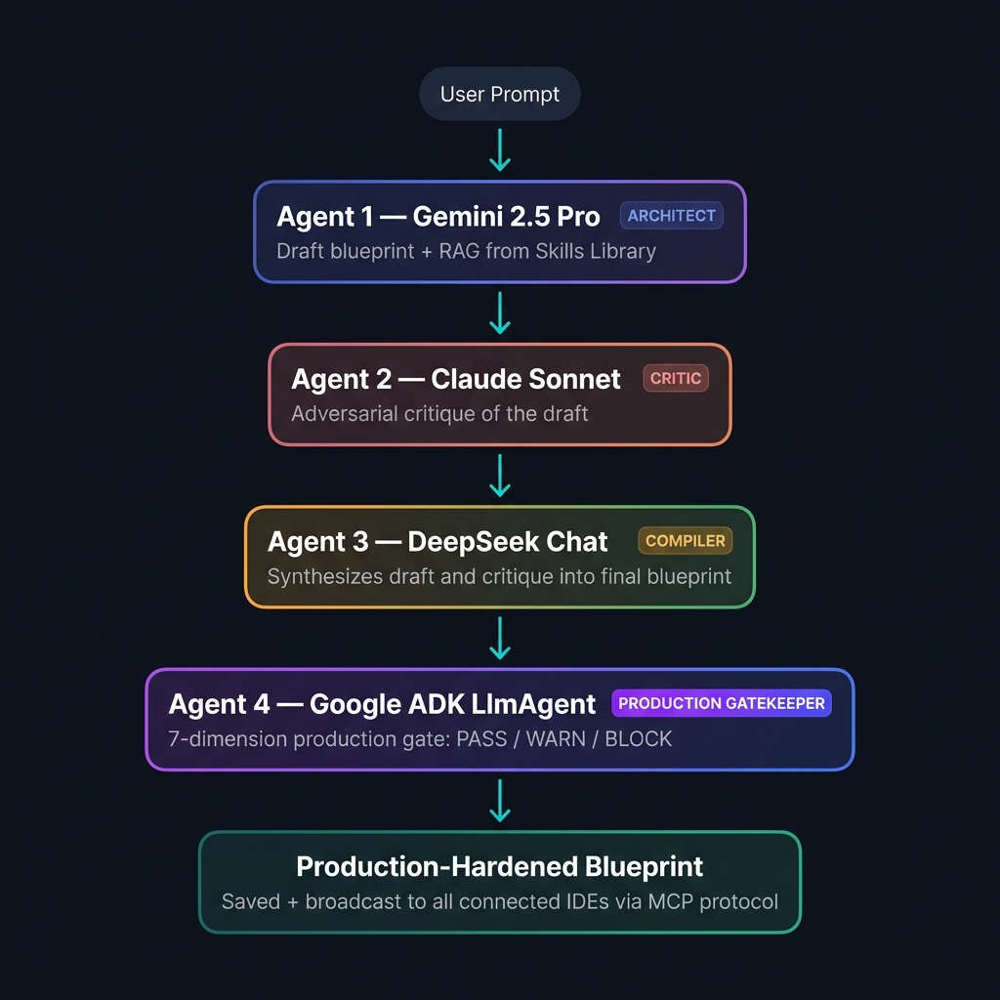

# 🔷 StructZero — The Multi-Agent Planning Layer for Agentic IDEs

> **Built on MCP · Powered by 4 AI Agents · Designed for Agentic IDEs**

StructZero is the missing planning layer between a developer's idea and their agentic IDE. Instead of prompting an IDE directly (getting shallow first-draft code), a developer sends their prompt through StructZero first — a **4-agent AI debate pipeline** that produces a secure, production-hardened architectural blueprint. The IDE takes that blueprint as input and generates dramatically better code.

**Same IDE. Same model. Dramatically different output quality.**

---

## The Problem: Agentic IDEs Are Excellent Executors but Weak Planners

Modern agentic IDEs like Antigravity, Cursor, and Windsurf have transformed how developers write code. Give them a prompt — "design an Android weather app" — and they generate a working scaffold in minutes.

But this power has a hidden cost: the quality of the output is bounded by the quality of the plan. When you give a vague prompt directly to an IDE, it generates shallow, first-draft code — no offline sync strategy, no error recovery, no security hardening, no production observability. The IDE is an exceptional executor. It is not an architect.

The result is a predictable pattern in engineering teams: a developer writes a prompt, gets a basic scaffold, then spends 2–3 days refactoring it because it wasn't designed for production from the start. This is expensive, demoralizing, and completely avoidable.

---

## The Solution: StructZero as the Missing Planning Layer

StructZero sits upstream of any agentic IDE. Instead of prompting the IDE directly, a developer sends their prompt to StructZero first. StructZero runs it through a 4-agent AI pipeline that produces a detailed, production-hardened architectural blueprint. That blueprint becomes the IDE's input — and the IDE, now working from a concrete plan instead of a vague description, generates dramatically better code.

**The before/after is the core demonstration:**

- **Direct IDE prompt:** "Design an Android app for live weather" → IDE generates a basic Activity with a hardcoded API call. No offline support. No error handling. No architecture.
- **StructZero-mediated prompt:** Same prompt → 4-agent debate produces a blueprint specifying: Room database for offline cache, WorkManager for background sync, Retrofit with OkHttp interceptors, MVVM with LiveData, exponential retry logic, and certificate pinning. → IDE is asked to implement the blueprint directly → generates production-shaped code.

---

## 🎬 Demo Video

Check out the full workflow in action:

[](https://youtu.be/uIMM8t2ksT0)

*(Click the image above to watch the full 2-minute demo video!)*

> **The core demo:** Prompt Antigravity directly → shallow scaffold. Send same prompt through StructZero debate → detailed blueprint → feed to Antigravity → production-grade implementation.

---

## ✨ Architecture: The 4-Agent Pipeline

StructZero orchestrates four AI agents, each with a distinct role and adversarial incentive. Splitting the work into four agents with opposing incentives directly counters the tendency of a single LLM to validate whatever framing the question provides. 



- **Agent 1 — Gemini 2.5 Pro (The Architect):** Receives the user's prompt enriched with a persistent memory bank (previous project decisions, tech stack preferences), a Skills Library RAG context (matching patterns from past blueprints), and User-configured ACL guardrails. Produces the initial architecture blueprint.
- **Agent 2 — Claude Sonnet (The Critic):** Receives the Gemini draft with Reviewer-role constraints. Its sole instruction is to find problems (e.g., missing rate limiting, weak CORS, over-engineered components). Claude is explicitly incentivized to disagree with the draft.
- **Agent 3 — DeepSeek Chat (The Compiler):** Receives both the original draft and the full critique. Synthesizes them into a final, balanced blueprint that preserves the architectural vision while addressing every critique.
- **Agent 4 — Google ADK LlmAgent (The Production Gatekeeper):** Performs a structured production readiness review across 7 operational dimensions: Observability, Resilience, Security, Scalability, Operability, Performance, and Data Integrity.

**The Feedback Loop:** If the ADK agent finds gaps, a single click on "Improve Blueprint with ADK Findings" re-injects all WARN and BLOCK items as hard constraints into the debate engine, triggering a new generation that explicitly resolves every flagged issue.

---

## 🔌 MCP Server: IDE Integration via Model Context Protocol

The core of StructZero's IDE integration is a full Model Context Protocol server (`mcp.js`) implementing the MCP SDK with 8 callable tools and 1 persistent resource. Any MCP-compatible IDE — Antigravity, Cursor, Claude Desktop — connects to StructZero via stdio.

### Available MCP Tools (8 total)

| Tool | What It Does |
|------|-------------|
| `generate_architecture` | Triggers the full 4-agent debate pipeline |
| `review_codebase` | Reviews code against active blueprint |
| `analyze_workspace` | Deep architectural review of any codebase |
| `store_memory` | Save persistent context facts per user |
| `search_memory` | Semantic memory search across sessions |
| `search_skills` | Query the reusable blueprint skills library |
| `troubleshoot_error` | AI-powered error resolution with codebase context |
| `switch_active_user` | Switch user profile for multi-developer teams |

**Resource:** `workspace://context` — Returns the full active blueprint plus memory bank as a single Markdown document, ensuring IDE agents and the planning pipeline always share the same ground truth.

When StructZero generates a new blueprint from any source (web UI or IDE tool call), a Socket.io architecture_update event broadcasts the result to all connected clients simultaneously. Multiple developers can connect separate IDE instances to the same StructZero server.

---

## 🛡️ Security: Defense Before Code Is Written

StructZero enforces security at every layer:

- **Static Application Security Testing (SAST):** Every blueprint is automatically audited for OWASP Top 10 patterns (missing rate limiting, weak CORS, absent authentication, XSS vectors, SQL injection risks, missing security headers). An "Auto-Fix" button re-runs the debate with the vulnerability as an explicit constraint.
- **ACL Guardrails:** Teams configure per-model constraint rules that are injected into every LLM prompt. A global constraint like "never recommend plaintext password storage" propagates to all four agents simultaneously.
- **Resilience Infrastructure:** Opossum circuit breaker for automatic cloud/local failover; p-queue concurrency control to prevent local model resource exhaustion; configurable budget breaker to cap monthly API spend.
- **Credential Handling:** No API keys are hardcoded anywhere in the codebase. All secrets load from a local `.env` file excluded via `.gitignore`; the ADK subprocess receives its key via environment variable, not command-line argument, avoiding exposure through process listings.

---

## 🧠 Skills Library: Compound Architectural Intelligence

Every blueprint generated by the debate engine passes through a background pipeline that extracts 1–3 reusable "skills" — isolated architectural patterns tagged by technology domain.

These serve two functions: 
1. The `search_skills` MCP tool lets any IDE retrieve relevant patterns without re-running the full debate (reducing token cost for common, previously-solved patterns).
2. When generating new blueprints, matching skills are injected as RAG context into the Gemini prompt, ensuring institutional knowledge compounds over time rather than being regenerated from scratch.

---

## 💎 Business Value

- **The real cost isn't the planning — it's the rework:** A few extra cents at the planning stage is some of the cheapest API spend in the entire development cycle. It prevents expensive mid-build troubleshooting and token spend on outdated APIs or deprecated libraries suggested by IDEs working from vague prompts.
- **Time reallocation:** Blueprints that would otherwise require a senior engineer's manual design review are generated and adversarially checked in minutes.
- **Earlier defect detection:** OWASP-class issues caught in the blueprint stage are cheaper to fix than the same issues caught after code is written.
- **Accessibility for non-coders:** Because StructZero's blueprint is a structured, readable document rather than raw code, someone without an engineering background can generate an architecture plan and paste that plan directly into the chat box of any agentic IDE, getting a genuinely production-shaped result.

---

## 🚀 Quick Start

### Prerequisites
- Node.js 18+
- Python 3.9+
- API Keys: Gemini (required), Anthropic Claude (required), DeepSeek (required)

### 1. Clone & Install Backend
```bash
git clone https://github.com/vishalvermauts/StructZero.git
cd StructZero-mcp-architect/backend
npm install
pip install google-adk   # For the ADK Production Gatekeeper agent

# Create .env from template
copy .env.example .env
# Edit .env with your API keys
```

### 2. Start Backend
```bash
node server.js
# Output: Fastify Server listening on port 3001
# Route tree includes: adk/production-check, architecture, generate, memory, skills...
```

### 3. Install & Start Frontend
```bash
cd ../frontend
npm install
npm run dev
# Frontend: http://localhost:5173
```

### 4. Connect to IDE
Add the following to your MCP client configuration (e.g., Antigravity, Cursor, Claude Desktop):
```json
{
  "mcpServers": {
    "StructZero": {
      "command": "node",
      "args": ["C:/path/to/StructZero/backend/mcp.js"]
    }
  }
}
```

---

## 📊 Tech Stack

| Layer | Technology |
|-------|-----------|
| **Backend** | Fastify 4, Node.js ESM, Socket.io 4 |
| **Agent Framework** | LangChain + LangGraph (Rounds 1–3 debate) |
| **ADK Agent** | Google ADK `LlmAgent` (Round 4 production gate) |
| **AI Providers** | Gemini 2.5 Pro, Claude Sonnet, DeepSeek Chat |
| **MCP** | @modelcontextprotocol/sdk v1.29 |
| **Database** | SQLite3 (zero infrastructure, local-first) |
| **Frontend** | React 18, Vite, TailwindCSS |
| **Diagram** | Mermaid.js (live architecture diagrams from blueprint) |
| **Code Editor** | Monaco Editor (blueprint diff viewer) |
| **Real-time** | Socket.io WebSockets (multi-IDE sync) |
| **Resilience** | Opossum circuit breaker, p-queue concurrency |

---

## 📜 License

MIT — Free to use, modify, and distribute.

## Local Vector Memory Bank
StructZero supports a fully local Vector Memory Bank powered by Ollama. By using the lightweight `nomic-embed-text` model, semantic embeddings are generated locally on your machine at zero cost. This ensures data privacy and fast, offline vector similarity searches for architectural drafts and system rules, without relying on external APIs.
